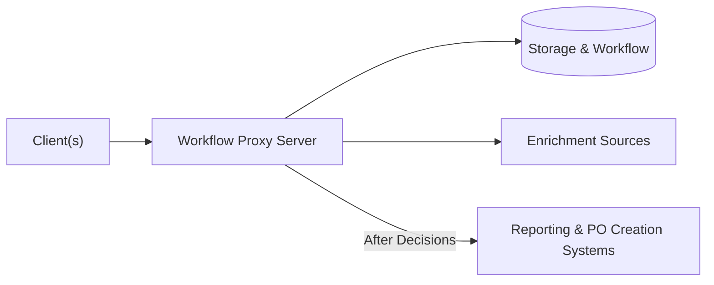

# Purchase Request Workflow Proxy Server

The Purchase Request platform creates a unified workflow for a library to receive, consider and process book purchase requests.  The primary goals are:
- to get more patron input on book purchase requests, from multiple sources
- to assist selectors in evaluating the requests
- and to assist technical services staff in acting on them.

[Several clients are available](#clients) to source purchase requests, both explicit and implied, from both patrons and library staff.

This **Workflow Proxy Server** component:
- **centralizes** incoming purchase requests from [all clients](#clients)
- [**saves** the requests](#storage--workflow) into a platform where librarian selectors can review each request and approve or deny it
- [**enriches** them](#enrichment) with information from various sources to help selectors with the decision
- [**routes** approved requests to external system(s)](#routing--reporting) for reporting or for acquisitions & cataloging steps on an approved request

## Storage & Workflow

The `WorkflowService` interface defines a system that stores purchase requests and can notify listeners when a request is accepted or rejected.

Supplied implementations:

- `JiraWorkflowService` supports both Jira Cloud (which offers a free tier that should suit this use case) and locally-hosted Jira Server.  Out-of-the-box, this supports simple manual decision making, such as using a Kanban board to drag a request from a New column to one representing Approved requests.  Jira workflows can also support automatic decision-making based on the metadata of the request.

- `RestyaboardWorkflowService` supports the Restyaboard Kanban board software.  This is provided as an open source alternative to Jira for a simple, manual workflow.

## Enrichment

`EnrichmentService` implementations enrich a purchase request with information that will help selectors to consider the purchase request.  Enrichment data may also support automated workflows or post-decision processing.

Individual enrichments can be selectively enabled in configuration.  As needed an order of enrichments can be specified.

Supplied implementations:

| Enrichment | Description | Data Source (API) Requirements |
| ---------- | ----------- | ------------------------ |
| Local Holdings | Identify existing local holdings, and link to them in the ILS/LSP or online catalog.  See also [Matching Pre-Submission](#matching-pre-submission).  | FOLIO or OCLC WorldCat |
| Consortial Holdings | Identify holdings at consortia with borrowing relationships. | OCLC WorldCat |
| Pricing | Gather list price information. | IsbnDB |
| Requester | Identify the patron's university role (i.e. faculty, undergraduate) and department as provided by the university's directory information. | LDAP | 
| Librarian Selector | Identify the librarian(s) who should decide the purchase request, based on the item's call number. | [Librarian Call Numbers](https://github.com/lehigh-university-libraries/librarian-call-numbers) |
| Budget Codes | Set budget codes to use if the purchase is approved, based on the librarian enrichment. | FOLIO |
| Identifiers | For use by the other enrichments, use supplied title & contributor to suggest (if not already supplied) an OCLC number and Dewey call number from Library of Congress holdings. | OCLC WorldCat 

## Clients

Client modules are available from separate repositories, as linked below.  See also [Client User Management](#client-user-management).

### Explicit Demand-Driven Acquisition

- [Website Form](https://github.com/lehigh-university-libraries/purchase-request-form-client).  Proof-of-concept of a traditional website form for explicit patron input on book purchases.
- [Returns Client](https://github.com/lehigh-university-libraries/purchase-request-returns-client).  Handles patron purchase requests on the return slips for interlibrary and consortial loan items. 

### Implicit Demand-Driven Acquisition

- Duplicate Requests Client (TBD).  Detects multiple, recent requests for the same interlibrary or consortial loan items, that suggest a purchase be considered.
- [Lost Items Client](https://github.com/lehigh-university-libraries/purchase-request-lost-items-client).  Detects items marked (definitively) lost in the ILS/LSP, perhaps following a patron request for the item, that should be considered for replacement.

### Other Clients

- [Browser Plug-in](https://github.com/lehigh-university-libraries/purchase-request-browser-plugin).  Aimed at librarian selectors, a browser plug-in for easily submitting library purchase requests from book review sites or anywhere else. 

## Routing & Reporting

The `WorkflowServiceListener` interface supports actions that take place after new purchase requests are submitted or after a status update to the request within the workflow system.  Specific trigger points are:

- Purchase Requested
- Purchase Approved
- Purchase Denied (TBD)

Supplied implementations:

| Listener | Description | Dependencies |
| -------- | ----------- | ------------------------------ |
| Email | Emails configurable recipients about a purchase request when its status changes.  [See Email Listener.](#email-listener) |  [Librarian enrichment](#enrichment) |
| Full Record Spreadsheet | Exports full details of a new or approved request to a spreadsheet, adding a row. | Google Sheets |
| MatchMARC Spreadsheet| Exports identifier and budget code metadata to a spreadsheet, adding a row, that is intended to be used with MatchMARC to create a FOLIO Purchase Order. | Google Sheets, [MatchMARC](https://github.com/suranofsky/tech-services-g-sheets-addon)

### Email Listener

The `EmailListener` sends an email based on the new status of a purchase request:

- Requested: To the librarian identified by [Librarian Enrichment](#enrichment) and to `workflow.email.purchase-requested-address`.
- Approved: To `workflow.email.purchase-approved-address`.
- Denied: To `workflow.email.purchase-denied-address`.
- Arrived: To the requester and to `workflow.email.purchase-arrived-address`.

The body text of the email is defined by a file `{statusName}.txt` within a `mail` subfolder of [the configuration folder where `application.properties` is located](#deployment).  The template uses [Thymeleaf's TEXT mode](https://www.thymeleaf.org/doc/tutorials/3.0/usingthymeleaf.html#textual-template-modes) and supports interpolation of any `PurchaseRequest` object properties as seen in the example files.

## Matching Pre-Submission

A matching service equivalent to [Local Holdings enrichment](#enrichment) is also available for clients to use before submitting a purchase request.  Informing the patron of potential local matches (linking to the catalog) may allow them to access the resource immediately.

## Deployment

The Workflow Proxy Server is a Java Spring Boot application.  [See Dependencies.](#dependencies)

The Maven configuration generates a .war file that can be run standalone (equivalent to a .jar), or deployed to Jetty (tested) or another web application server like Tomcat.

In either case, it requires the `application.properties` configuration file to be available [where the application can find it](https://docs.spring.io/spring-boot/docs/current/reference/htmlsingle/#features.external-config).

### Standalone JAR File (with embedded Tomcat)

Recommended only as a development instance, as this runs the server over insecure HTTP.  In that context, it's simplest to just store the `application.properties` in the same directory as the .war file.

To run in the foreground:

`java -jar purchase-request-workflow-proxy-server.war`

... or for background execution on Linux, logging to nohup.out:

`nohup java -jar purchase-request-workflow-proxy-server.war &`

When using the Email Listener, add to the classpath the extra folder containing the `templates` folder:

`java -cp ./extra_classpath:./purchase-request-workflow-proxy-server.war org.springframework.boot.loader.WarLauncher`

... or for background execution:

`nohup java -cp ./extra_classpath:./purchase-request-workflow-proxy-server.war org.springframework.boot.loader.WarLauncher &`

### Deployed to Jetty

Intended for a production environment.  Set up a web server to handle secure (HTTPS) requests and direct them to Jetty.

Tested with Jetty 9 and Apache Web Server.

Deploy the .war file in Jetty's `webapps` folder (or as otherwise configured).  To point to the configuration file, create an [descriptor .xml file](https://www.eclipse.org/jetty/documentation/jetty-9/index.html#configuring-specific-webapp-deployment) with otherwise the same filename as the .war, and set the `extraClasspath` variable to point to a folder with with the `application.properties`.  Example:

    <?xml version="1.0" encoding="UTF-8"?>
    <!DOCTYPE Configure PUBLIC "-//Jetty//Configure//EN" "http://www.eclipse.org/jetty/configure_9_3.dtd">

    <Configure class="org.eclipse.jetty.webapp.WebAppContext">
        <Set name="contextPath">/pr-server</Set>
        <Set name="war">/path/to/jetty9/webapps/purchase-request-workflow-proxy-server.war.war</Set>
        <Set name="extraClasspath">/path/to/config/stuff/pr-server-conf</Set>
    </Configure>

## Dependencies

- Java SE.  Tested on Java SE 11 (LTE).
- MySQL or equivalent.  Tested with MariaDB.  Uses Spring Data so a different DB driver could presumably be included with appropriate Maven configuration.
- Additional dependencies needed for a workflow service and individual enrichments.  [See configuration.](#configuration)

## Initial Setup

1. Set up the [configuration file](#configuration).

1. If using the Email Listener, copy or rename each email template file (removing ".example") and [edit as needed](#email-listener).

1. Uncomment this property to the configuration file before starting the application is run for the first time, to create the database schema.  *Then re-comment or remove it*:

    `# spring.jpa.hibernate.ddl-auto=create-drop`

## Client User Management

Client applications access the Workflow Proxy Server via an API, using [Basic Authentication](https://en.wikipedia.org/wiki/Basic_access_authentication) over HTTPS.  These are stored (encrypted) in the [database](#database-section).

Scripts are available to add and remove client credentials.  They utilize the same `purchase-request-workflow-proxy-server.war` built via Maven, and the same [configuration file](#configuration).

### Add Client Credentials

In the project home directory, run:

`scripts/add_client.sh username password`

### Delete Client Credentials

In the project home directory, run:

`scripts/delete_client.sh username`

## Configuration

Copy/rename `application.properties.example` to `application.properties` and configure its parameters.  See example values in that file.

| Property | Description | Required |
| -- | -- | -- |
| workflow.enabled | Enable the application. Must be 'true'.  | Y |
| workflow.storage | Storage & workflow engine used.  Must be 'jira' or 'restyaboard'.  | Y |

### Database Section

A linked MySQL database.  The database is used only for local authentication credential storage.

| Property | Description | Required |
| -- | -- | -- |
| workflow.db.host | Database hostname | Y |
| workflow.db.name | Database schema name | Y |
| workflow.db.username | Database username | Y |
| workflow.db.password | Database password | Y |

#### Spring Data

Keep these properties as-is in your `application.config`:

    spring.datasource.url=jdbc:mysql://${workflow.db.host:localhost}:3306/${workflow.db.name}
    spring.datasource.username=${workflow.db.username}
    spring.datasource.password=${workflow.db.password}
    spring.datasource.driver-class-name=com.mysql.jdbc.Driver
    spring.jpa.database-platform=org.hibernate.dialect.MySQL5InnoDBDialect

### Jira Section

For use with `JiraWorkflowService` implementation, connecting via Jira's API as the purchase requests storage and workflow engine.

| Property | Description | Required |
| -- | -- | -- |
| workflow.jira.hosting | `cloud` or `server`, depending on the [Jira software deployment](https://www.atlassian.com/blog/platform/cloud-vs-server).  The [free cloud plan](https://www.atlassian.com/software/jira/free) should be sufficient for this app. | If `workflow.storage` is `jira` |
| workflow.jira.url | URL for the Jira API | If `workflow.storage` is `jira` |
| workflow.jira.username | Username for the Jira API | If `workflow.storage` is `jira` |
| workflow.jira.token | [API token](https://support.atlassian.com/atlassian-account/docs/manage-api-tokens-for-your-atlassian-account/) for the Jira account | If `workflow.storage` is `jira` |
| workflow.jira.project | Jira [project key](https://support.atlassian.com/jira-software-cloud/docs/what-is-an-issue/#Workingwithissues-Projectkeys) | If `workflow.storage` is `jira` |
| workflow.jira.issueTypeId | ID of the Jira [issue type](https://support.atlassian.com/jira-cloud-administration/docs/what-are-issue-types/) to use for purchase requests.  Find the ID [via an API call](https://developer.atlassian.com/cloud/jira/platform/rest/v3/api-group-issue-types/#api-group-issue-types) or [via the Jira UI](https://confluence.atlassian.com/jirakb/finding-the-id-for-issue-types-646186508.html) | If `workflow.storage` is `jira` |
| workflow.jira.maxSearchResults | Maximum results to return when retrieving issues in bulk. | If `workflow.storage` is `jira` |
| workflow.jira.multipleLibrariansUsername | Username of a Jira user / librarian to assign a purchase request to via Librarian Enrichment, if the enrichment determines that more than one librarian is interested in the item's call number.  Intended to be a username that forwards email to all librarian selectors. | If `workflow.storage` is `jira` |

#### Jira Statuses

These parameters define the IDs and names of Jira statuses and the transitions between them.

| Property | Description | Required |
| -- | -- | -- |
| workflow.jira.deferredStatusName | Name of the Jira status used to identify purchases that the librarian selectors want to review at a later date.   If omitted, the server cannot transition requests to that status when set on newly submitted requests.  See `approvedStatusId` for finding value. | N |
| workflow.jira.deferredStatusTransitionId | ID of the Jira transition that takes an issue from New to the Deferred status.  See `approvedStatusTransitionId` for finding value. | If `workflow.jira.deferredStatusName` is set
| workflow.jira.approvedStatusId | ID of the Jira status to use identify approved purchases.  Find the ID [via an API call](https://developer.atlassian.com/cloud/jira/platform/rest/v3/api-group-status/#api-group-status) or [via the Jira UI](https://community.atlassian.com/t5/Jira-Service-Management/How-do-I-get-a-list-of-statuses-that-show-the-associated-status/qaq-p/1803682). | If `workflow.storage` is `jira` | 
| workflow.jira.approvedStatusName | Name of the Jira status used to identify approved purchases.  See `approvedStatusId` for finding value. | If `workflow.storage` is `jira` |
| workflow.jira.approvedStatusTransitionId | ID of the Jira transition that takes an issue from New to Approved. Find the ID [via an API call](https://developer.atlassian.com/cloud/jira/platform/rest/v3/api-group-issues/#api-rest-api-3-issue-issueidorkey-transitions-get) |  If `workflow.storage` is `jira` |
| workflow.jira.deniedStatusId | ID of the Jira status to use identify denied purchase requests.  See `approvedStatusId` for finding value. | If `workflow.storage` is `jira` | 
| workflow.jira.arrivedStatusId | ID of the Jira status to use identify purchases that have arrived at their destination.  See `approvedStatusId` for finding value. | If `workflow.storage` is `jira` | 

#### Jira Field IDs

Each of the following configuration parameters defines the Jira ID of a custom field used to store purchase request data.  Find the ID [via an API call](https://developer.atlassian.com/cloud/jira/platform/rest/v3/api-group-issue-fields/#api-group-issue-fields) or [via the Jira UI](https://ja.confluence.atlassian.com/jirakb/how-to-find-id-for-custom-field-s-744522503.html).

| Property | Description | Required |
| -- | -- | -- |
| workflow.jira.contributorFieldId | Stores the contributor (author) name. | If `workflow.storage` is `jira` | 
| workflow.jira.isbnFieldId | Stores the ISBN. | If `workflow.storage` is `jira` | 
| workflow.jira.oclcNumberFieldId | Stores the OCLC number. | If `workflow.storage` is `jira` and `workflow.identifiers` is set | 
| workflow.jira.callNumberFieldId | Stores the Dewey call number. | If `workflow.storage` is `jira` and `workflow.identifiers` is set | 
| workflow.jira.formatFieldId | Stores the requested book format (i.e. print, electronic). | If `workflow.storage` is `jira` | 
| workflow.jira.speedFieldId | Stores the requested delivery speed. | If `workflow.storage` is `jira` | 
| workflow.jira.destinationFieldId | Stores the requested destination of the item after purchase. | If `workflow.storage` is `jira` | 
| workflow.jira.clientNameFieldId | Stores the name of the client application that submitted a purchase request. | If `workflow.storage` is `jira` | 
| workflow.jira.requesterUsernameFieldId | Stores the email / LDAP username of the patron or staff member who requested an item. | If `workflow.storage` is `jira` | 
| workflow.jira.requesterRoleFieldId | Stores the role, department and/or other description of the requester, as provided by LDAP. | If `workflow.storage` is `jira` and `workflow.requester` is set | 
| workflow.jira.fundCodeFieldId | Stores the requested budget fund code to assign to an item purchase. | If `workflow.storage` is `jira` and `workflow.enrichment.budget-code` is set | 
| workflow.jira.objectCodeFieldId | Stores the requested budget object code to assign to an item purchase. | If `workflow.storage` is `jira` and `workflow.enrichment.budget-code` is set | 
| workflow.jira.postPurchaseIdFieldId | Stores the unique ID of a purchased item, for use in emails about Arrived purchase requests. | If `workflow.storage` is `jira` | 

### Restyaboard Section

For use with `RestyaboardWorkflowService` implementation, connecting via Restyaboard's API as the purchase requests storage and workflow engine.

| Property | Description | Required |
| -- | -- | -- |
| workflow.restyaboard.base-url | URL for the Restyaboard API | If `workflow.storage` is `restyaboard` |
| workflow.restyaboard.username | Username for the Restyaboard API | If `workflow.storage` is `restyaboard` |
| workflow.restyaboard.password | Password for the Restyaboard API | If `workflow.storage` is `restyaboard` |
| workflow.restyaboard.board-id | ID of the Restyaboard board to use for purchase requests.  The ID is in the URL when viewing the board. | If `workflow.storage` is `restyaboard` |
| workflow.restyaboard.new-request-list-id | ID of the list to which new purchase requests should be added. Find the ID [via an API call](https://board.demo.restya.com/api_explorer/#!/lists/get_v1_boards_boardId_lists_json). | If `workflow.storage` is `restyaboard` | 

### Identifiers Enrichment Section

| Property | Description | Required |
| -- | -- | -- |
| workflow.identifiers | `OCLC` to enable Identifiers Enrichment | N |

### Budget Code Enrichment Section

| Property | Description | Required |
| -- | -- | -- |
| workflow.budget-code | `FOLIO` to enable Budget Code Enrichment | N |

### OCLC Section

OCLC APIs are used by various [holdings enrichment steps](#enrichment) and the [match service](#matching-pre-submission).

| Property | Description | Required |
| -- | -- | -- |
| workflow.oclc.wsKey | [API wsKey from OCLC](https://www.oclc.org/developer/develop/authentication/what-is-a-wskey.en.html) with access to the WorldCat API. | Y | 
| workflow.oclc.secret | API secret from OCLC to use with the wsKey | Y |
| workflow.oclc.localInstitutionSymbol | Three-letter OCLC institutional symbol | Y | 
| workflow.oclc.classification-type | `dewey` or other key available in the `classification` result from an OCLC search, present in records cataloged by the Library of Congress (DLC).  Used by the Librarian Service. | Y | 

### Local Holdings Enrichment Section

| Property | Description | Required |
| -- | -- | -- |
| workflow.localHoldings.dataSource | `FOLIO` or `OCLC` to enable Local Holdings Enrichment.  Determines which source and algorithm is used to identify any local holdings. | N | 
| workflow.localHoldings.linkTo | `VuFind` or `FOLIO`.  Determines which destination the local holdings search results should link to. | If `workflow.localHoldings.dataSource` is set | 

### Group Holdings Section

| Property | Description | Required |
| -- | -- | -- |
| workflow.groupHoldings.dataSource | `OCLC` to enable Group Holdings Enrichment. | N |
| workflow.groupHoldings.oclcSymbols | Comma-separated list of OCLC group symbols representing consortia that the institution belongs to.  The application will check and report separately on holdings for each group. | If `workflow.groupHoldings.dataSource` is set |

### FOLIO Section

For connecting to the FOLIO API.

| Property | Description | Required |
| -- | -- | -- |
| workflow.folio.username | Username for the FOLIO API. | Y |
| workflow.folio.password | Password for the FOLIO API. | Y |
| workflow.folio.tenantId | Tenant ID for the FOLIO server environment. | Y |
| workflow.folio.okapiBaseUrl | Base URL for FOLIO OKAPI API calls. | Y |
| workflow.folio.websiteBaseUrl | Base URL for the FOLIO UI.  Used to format links to FOLIO local holdings. | Y | 

### VuFind Section

| Property | Description | Required |
| -- | -- | -- |
| workflow.vu-find.base-url | Base URL for the VuFind catalog UI.  Used to format links to VuFind local holdings. | Y |

### Requester Enrichment Section

Used for information about the patron requesting a purchase.

| Property | Description | Required |
| -- | -- | -- |
| workflow.requester | `ldap` to enable requester enrichment | N |
| spring.ldap.urls | URL for LDAP queries. | If `workflow.requester` is set |
| spring.ldap.base | Base string for LDAP queries. | If `workflow.requester` is set |
| workflow.ldap.username-query-field | Parameter representing the username in the LDAP query.  Generally `uid`.  | If `workflow.requester` is set | 
| workflow.ldap.role-result-field | LDAP search result field containing the role string reported by Requester Enrichment.  Generally `description`. | If `workflow.requester` is set | 

### Pricing Enrichment Section

Used by Pricing Enrichment to retrieve the list price(s) of a requested purchase.  The [IsbnDB API](https://isbndb.com/isbn-database) is is a commercial service, but relatively affordable (~ $10/m).

| Property | Description | Required |
| -- | -- | -- |
| workflow.pricing | `IsbnDB` to enable pricing enrichment | N |
| workflow.isbn-db.method | `title` or `isbn`.  Two methods are available to search IsbnDB.  Title search is recommended, as the odds of a given ISBN being present in the database are lower. | If `workflow.pricing` is set |
| workflow.isbn-db.api-key | API key provided by IsbnDB. | If `workflow.pricing` is set |
| workflow.isbn-db.title-search.filter-on-contributor | `true` or `false`.  If `true`, title search results are filtered by the requested contributor name. | If `workflow.isbn-db.method` is title | 

### Librarian Enrichment Section

Librarian Enrichment makes use of a separate [Librarian Call Numbers](https://github.com/lehigh-university-libraries/librarian-call-numbers) web service which maps a call number to a list of librarians who are involved in selection for that range.

| Property | Description | Required |
| -- | -- | -- |
| workflow.librarian-call-numbers | `service` to enable librarian enrichment. | N |
| workflow.librarian-call-numbers.base-url | Base URL of the Librarian Call Numbers service. | If `workflow.librarian-call-numbers` is set |

### Email Section

For reporting via the Email Listener.

| Property | Description | Required |
| -- | -- | -- |
| spring.mail.host | Hostname of an SMTP server | Y |
| spring.mail.port | Port of the SMTP server | Y |
| workflow.email.subject-prefix | Prefix the subject line for all emails, such as to identify a test environment. | N |
| workflow.email.from-address | From address to use in reporting emails | Y | 
| workflow.email.purchase-requested-address | Email address to send notification when a new purchase is requested, *in addition* to the emails of any associated librarians from Librarian Enrichment. | N |
| workflow.email.purchase-approved-address | Email address to send notification when a purchase is approved. | N |
| workflow.email.purchase-denied-address | Email address to send notification when a purchase is denied. | N |
| workflow.email.purchase-arrived-address | Email address to send notification when a purchase arrives at its destination, *in addition* to the requester's email. | N |
| workflow.email.address-domain | Suffix after 'username@' that creates an email address. | Y |
| workflow.email.purchase-requested-delay | Delay after a new purchase before any email is sent, if specified.  Format as a [Java 8 Duration](https://docs.oracle.com/javase/8/docs/api/java/time/Duration.html#parse-java.lang.CharSequence-). | N |
| workflow.email.purchase-approved-delay | Delay after a purchase request is approved before any email is sent, if specified.  See `purchase-requested-delay` for format. | N |
| workflow.email.purchase-denied-delay | Delay after a purchase request is denied before any email is sent, if specified.  See `purchase-requested-delay` for format. | N |
| workflow.email.purchase-arrived-delay | Delay after a purchase request is arrived before any email is sent, if specified.  See `purchase-requested-delay` for format. | N |

### Google Sheets Listener Section

For reporting to Google Sheets spreadsheets.  See [reporting and post-approval processing](#routing--reporting) for additional details.

| Property | Description | Required |
| -- | -- | -- |
| workflow.google-sheets.credentials-file-path | Path to the file containing the `google-sheets-client-secret.json` file provided by [Google Cloud](https://developers.google.com/workspace/guides/get-started) to the Google Workspace APIs. | If any of the other `workflow.google-sheets.*` properties are set |
| workflow.google-sheets.match-marc.approved-spreadsheet-id | ID of a spreadsheet to use for reporting approved items in MatchMARC format. | N |
| workflow.google-sheets.full-record.requested-spreadsheet-id | ID of a spreadsheet to use for reporting newly requested items in full record format. | N |
| workflow.google-sheets.full-record.approved-spreadsheet-id | ID of a spreadsheet to use for reporting approved items in full record format. | N |

### Debugging

To optionally change the default [SLF4J](https://www.slf4j.org/index.html) logging [level](https://www.slf4j.org/api/org/slf4j/event/Level.html#enum.constant.summary) from INFO.

| Property | Description | Required |
| -- | -- | -- |
| logging.level.edu.lehigh.libraries.purchase_request | `DEBUG`, `ERROR`, etc. | N |
