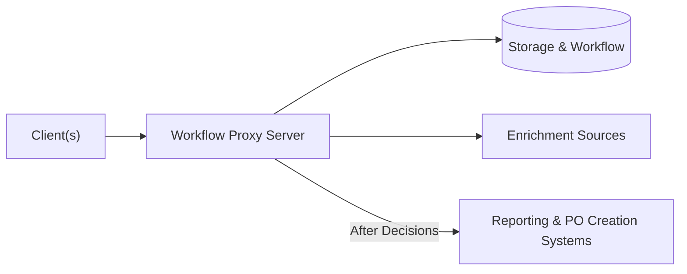

# Purchase Request Workflow Proxy Server

The Purchase Request platform creates a unified workflow for a library to receive, consider and process book purchase requests.  The primary goals are:
- to get more patron input on book purchase requests, from multiple sources
- to assist selectors in evaluating the requests
- and to assist technical services staff in acting on them.

[Several clients are available](#clients) to source purchase requests, both explicit and implied, from both patrons and library staff.

This **Workflow Proxy Server** component:
- **centralizes** incoming purchase requests from [all clients](#clients)
- [**saves** the requests](#storage--workflow) into a platform where librarian selectors can review each request and approve or deny it
- [**enriches** them](#enrichment) with information from various sources to help selectors with the decision
- [**routes** approved requests to external system(s)](#routing--reporting) for reporting or for acquisitions & cataloging steps on an approved request

## Storage & Workflow

The `WorkflowService` interface defines a system that stores purchase requests and can notify listeners when a request is accepted or rejected.

Supplied implementations:

- `JiraWorkflowService` supports both Jira Cloud (which offers a free tier that should suit this use case) and locally-hosted Jira Server.  Out-of-the-box, this supports simple manual decision making, such as using a Kanban board to drag a request from a New column to one representing Approved requests.  Jira workflows can also support automatic decision-making based on the metadata of the request.

- An additional packaged implementation is planned against an open source Kanban tool.  Suggestions welcome.

## Enrichment

`EnrichmentService` implementations enrich a purchase request with information that will help selectors to consider the purchase request.  Enrichment data may also support automated workflows or post-decision processing.

Individual enrichments can be selectively enabled in configuration.  As needed an order of enrichments can be specified.

Supplied implementations:

| Enrichment | Description | Data Source (API) Requirements |
| ---------- | ----------- | ------------------------ |
| Local Holdings | Identify existing local holdings, and link to them in the ILS/LSP or online catalog.  See also [Matching Pre-Submission](#matching-pre-submission).  | FOLIO or OCLC WorldCat |
| Consortial Holdings | Identify holdings at consortia with borrowing relationships. | OCLC WorldCat |
| Pricing | Gather list price information. | IsbnDB |
| Requester | Identify the patron's university role (i.e. faculty, undergraduate) and department as provided by the university's directory information. | LDAP | 
| Librarian Selector | Identify the librarian(s) who should decide the purchase request, based on the item's call number. | [Librarian Call Numbers](https://github.com/lehigh-university-libraries/librarian-call-numbers) |
| Budget Codes | Set budget codes to use if the purchase is approved, based on the librarian enrichment. | n/a, depends on Librarian enrichment |
| Identifiers | For use by the other enrichments, use supplied title & contributor to suggest (if not already supplied) an OCLC number and Dewey call number from Library of Congress holdings. | OCLC WorldCat 

## Clients

Client modules are available from separate repositories, as linked below.  

### Explicit Demand-Driven Acquisition

- [Website Form](https://github.com/lehigh-university-libraries/purchase-request-form-client).  Proof-of-concept of a traditional website form for explicit patron input on book purchases.
- [Returns Client](https://github.com/lehigh-university-libraries/purchase-request-returns-client).  Handles patron purchase requests on the return slips for interlibrary and consortial loan items. 

### Implicit Demand-Driven Acquisition

- Duplicate Requests Client (TBD).  Detects multiple, recent requests for the same interlibrary or consortial loan items, that suggest a purchase be considered.
- [Lost Items Client](https://github.com/lehigh-university-libraries/purchase-request-lost-items-client).  Detects items marked (definitively) lost in the ILS/LSP, perhaps following a patron request for the item, that should be considered for replacement.

### Other Clients

- [Browser Plug-in](https://github.com/lehigh-university-libraries/purchase-request-browser-plugin).  Aimed at librarian selectors, a browser plug-in for easily submitting library purchase requests from book review sites or anywhere else. 

## Routing & Reporting

The `WorkflowServiceListener` interface supports actions that take place after new purchase requests are submitted or after a status update to the request within the workflow system.  Specific trigger points are:

- Purchase Requested
- Purchase Approved
- Purchase Denied (TBD)

Supplied implementations:

| Listener | Description | Dependencies |
| -------- | ----------- | ------------------------------ |
| Email | Emails a specified address, and (TBD) the assigned librarian selectors, about new purchase requests. |  [Librarian enrichment](#enrichment) |
| Full Record Spreadsheet | Exports full details of a new or approved request to a spreadsheet, adding a row. | Google Sheets |
| MatchMARC Spreadsheet| Exports identifier and budget code metadata to a spreadsheet, adding a row, that is intended to be used with MatchMARC to create a FOLIO Purchase Order. | Google Sheets, [MatchMARC](https://github.com/suranofsky/tech-services-g-sheets-addon)

## Matching Pre-Submission

A matching service equivalent to [Local Holdings enrichment](#enrichment) is also available for clients to use before submitting a purchase request.  Informing the patron of potential local matches (linking to the catalog) may allow them to access the resource immediately.

## Deployment

The Workflow Proxy Server is a Java Spring Boot application, built on Java SE 11 (LTS).

The Maven configuration generates a .war file that can be run standalone (equivalent to a .jar), or deployed to Jetty (tested) or another web application server like Tomcat.

In either case, it requires the `application.properties` configuration file to be available [where the application can find it](https://docs.spring.io/spring-boot/docs/current/reference/htmlsingle/#features.external-config).

### Standalone JAR File (with embedded Tomcat)

Recommended only as a development instance, as this runs the server over insecure HTTP.  In that context, it's simplest to just store the `application.properties` in the same directory as the .war file.

To run in the foreground:

`java -jar purchase-request-workflow-proxy-server.war`

Or for background execution on Linux, logging to nohup.out:

`nohup java -jar purchase-request-workflow-proxy-server.war &`

### Deployed to Jetty

Intended for a production environment.  Set up a web server to handle secure (HTTPS) requests and direct them to Jetty.

Tested with Jetty 9 and Apache Web Server.

Deploy the .war file in Jetty's `webapps` folder (or as otherwise configured).  To point to the configuration file, create an [descriptor .xml file](https://www.eclipse.org/jetty/documentation/jetty-9/index.html#configuring-specific-webapp-deployment) with otherwise the same filename as the .war, and set the `extraClasspath` variable to point to a folder with with the `application.properties`.  Example:

    <?xml version="1.0" encoding="UTF-8"?>
    <!DOCTYPE Configure PUBLIC "-//Jetty//Configure//EN" "http://www.eclipse.org/jetty/configure_9_3.dtd">

    <Configure class="org.eclipse.jetty.webapp.WebAppContext">
        <Set name="contextPath">/pr-server</Set>
        <Set name="war">/path/to/jetty9/webapps/purchase-request-workflow-proxy-server.war.war</Set>
        <Set name="extraClasspath">/path/to/config/stuff/pr-server-conf</Set>
    </Configure>
